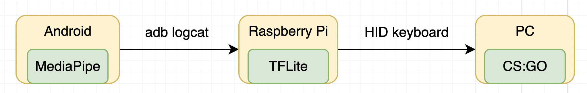

# Plans

AI Play Game大体架构

## ARCH

## 主要涉及内容

* MediaPipe
* Android MediaPipe及手掌3D数据采集
* 手掌3D数据展示
* 手掌3D数据TF训练
* 树莓派运行MediaPipe
* 树莓派USB虚拟HID键盘
* 树莓派运行TFLite
* TFLite与USB虚拟HID键盘通信
* Android手势控制CS:GO

## Example

## 3D MeidaPipe Data

## Android MeidaPipe

